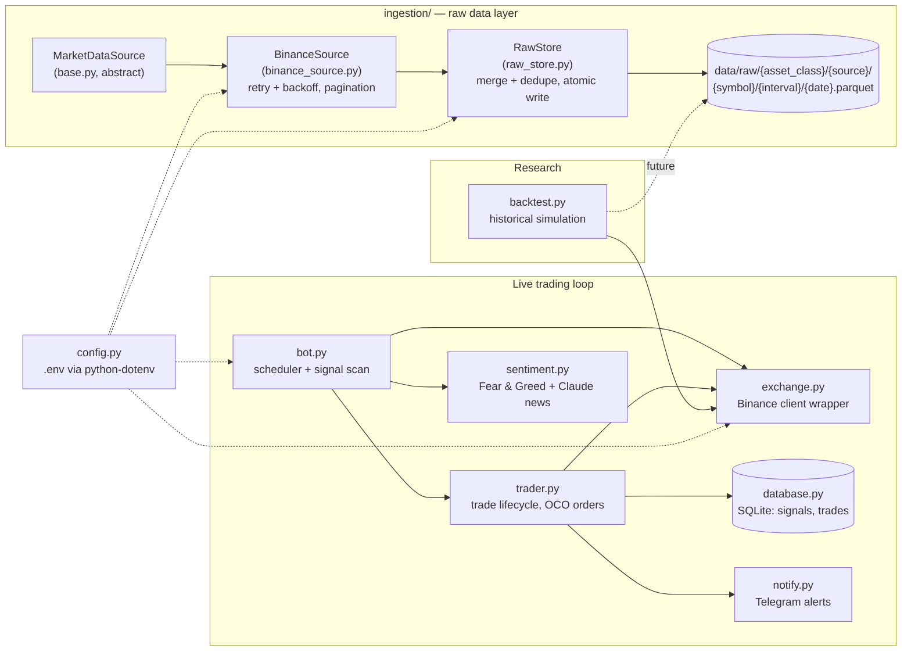

# Market Data Platform

A data platform for financial market data covering ingestion, storage, analysis, and backtesting. It started as a Binance spot trading bot; the current focus is building a reproducible, idempotent raw-data layer underneath it before drawing any further conclusions from the strategy itself.

## Architecture



**How the pieces fit together:**

| Module | Responsibility |
|---|---|
| `config.py` | Central configuration; secrets loaded from `.env` via `python-dotenv`, never hardcoded |
| `exchange.py` | Thin Binance client wrapper used by the live bot: fetches recent klines, places market/OCO orders, rounds lot size/tick size |
| `bot.py` | Indicator calculations, entry-signal strategy, APScheduler loop that scans symbols hourly |
| `trader.py` | Trade lifecycle: opens positions, places OCO take-profit/stop-loss, emergency-closes on OCO failure, syncs fills back into the database |
| `database.py` | SQLite persistence for generated signals and the full trade lifecycle |
| `notify.py` | Telegram push notifications for trade events and circuit breakers |
| `sentiment.py` | Fear & Greed Index + Claude-Haiku-based news sentiment, used as a trade filter |
| `backtest.py` | Historical strategy simulation with equity curve, drawdown, and fee accounting |
| `ingestion/` | Source-agnostic data ingestion layer (see below) — decoupled from the live trading path |

**`ingestion/` in detail:**

- `MarketDataSource` (`base.py`) — abstract base class defining `fetch_ohlcv(symbol, interval, start, end) -> DataFrame` and the canonical output schema: `timestamp` (UTC, tz-aware), `open`, `high`, `low`, `close`, `volume`, `source`, `symbol`, `interval`.
- `BinanceSource` (`binance_source.py`) — first concrete implementation. Paginates over long date ranges via `startTime`/`endTime`, retries with exponential backoff on rate-limit responses (HTTP 429/418 or Binance error `-1003`), and deduplicates any candle overlap at page boundaries.
- `RawStore` (`raw_store.py`) — writes OHLCV DataFrames to Parquet, partitioned by day, at `data/raw/{asset_class}/{source}/{symbol}/{interval}/{date}.parquet`. Writing is idempotent: it reads the existing partition (if any), merges in the new rows, deduplicates on `(timestamp, source, symbol, interval)`, and writes back atomically (temp file + rename) — loading the same or an overlapping time range twice never produces duplicate rows.

This layer is intentionally decoupled from `bot.py` and `exchange.py`: it exists to build a reproducible historical dataset, not to serve the live trading loop.

## Tech stack

- **Language:** Python 3.13
- **Data:** pandas, numpy, pyarrow (Parquet)
- **Exchange:** python-binance (REST client)
- **Storage:** SQLite (live trade/signal state), Parquet on local disk (raw market data)
- **Scheduling:** APScheduler
- **Sentiment:** Anthropic Claude (Haiku) + RSS news feeds
- **Notifications:** Telegram Bot API via `requests`
- **Config:** `python-dotenv`
- **Testing:** pytest, pytest-cov, unittest.mock

## Setup

```bash
python3 -m venv venv
source venv/bin/activate

pip install -r requirements.txt          # runtime dependencies
pip install -r requirements-dev.txt       # + pytest/pytest-cov for development

cp .env.example .env                      # then fill in your real credentials
```

`.env` variables (see `.env.example`):

| Variable | Required for | Notes |
|---|---|---|
| `BINANCE_API_KEY` / `BINANCE_API_SECRET` | Live trading, backtesting, ingestion | Read-only keys are sufficient for ingestion/backtesting |
| `TELEGRAM_TOKEN` / `TELEGRAM_CHAT_ID` | Trade notifications | Optional — notifications are silently skipped if unset |
| `ANTHROPIC_API_KEY` | News sentiment filter | Optional — sentiment defaults to neutral (0.0) if unset |
| `LOG_LEVEL` / `LOG_FILE` | Logging | Optional overrides, see `config.py` |

`.env` is gitignored; never commit real credentials.

## Running tests

```bash
python -m pytest tests/ -v

# with coverage
python -m pytest tests/ --cov=bot --cov-report=term-missing
```

All tests run against synthetic data or mocked clients (`unittest.mock`) — no real API calls, no real orders.

## Running a backtest

```bash
python backtest.py                          # 365 days, all symbols from config.py
python backtest.py --days 730                # 2 years
python backtest.py --symbols BTCUSDT ETHUSDT  # subset of symbols
```

Reports per-symbol and combined win rate, profit factor, fees, drawdown, and final equity based on historical Binance klines fetched live at run time.

## Results and findings

Backtest of the EMA/RSI/MACD/ATR strategy (`bot.py`) against historical Binance spot data, including a realistic 0.1%-per-side taker fee:

| Period | Scope | Net return | Profit factor | Fees | Gross profit |
|---|---|---|---|---|---|
| 90 days | BTCUSDT only | **−6.8%** | **0.75** | — | — |
| 365 days | 3 symbols combined | **+12.5%** | **1.04** | **$847** | **~$972** |

**Conclusion:** transaction costs consume most of the strategy's edge — in the 365-day run, fees ate roughly 87% of gross profit, and a profit factor of 1.04 leaves almost no margin for error. Results also swing sharply with the chosen time window (a strongly profitable year vs. a losing quarter), which means single-run backtest numbers are not a reliable basis for judging the strategy.

This is exactly why the current priority is the `ingestion/` raw-data layer rather than further strategy tuning: without a fixed, reproducible historical dataset and proper walk-forward validation, any backtest result — good or bad — is not trustworthy enough to act on.

## Roadmap

- **Backfill** — bulk-load full symbol/interval history through `ingestion/` into the Parquet raw layer, so backtests run against a fixed dataset instead of live API pulls
- **Data quality checks** — gap detection, duplicate/monotonicity checks, and schema validation on raw partitions before they're used downstream
- **Second data source** — add another `MarketDataSource` implementation (e.g. a different exchange) to cross-validate prices and reduce single-source risk
- **Azure migration** — move raw storage from local Parquet to Azure (Blob Storage / Data Lake), enabling shared access and scheduled ingestion jobs
- **Power BI** — dashboards on top of the raw/processed data for strategy and market analysis outside of log files
